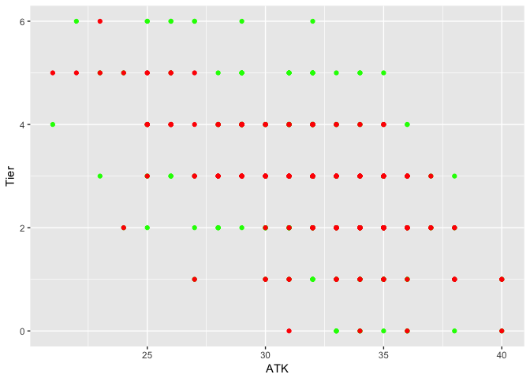
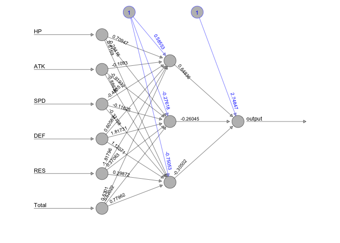
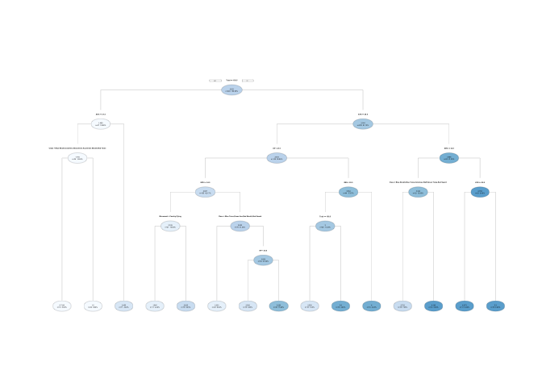

FEH Tier Prediction
================
Timothy Tan
May 16, 2018

### Introduction

The popular mobile game, Fire Emblem Heroes, has many different groups of people trying to figure out what are the best characters? One such website is fireemblemheroes.gamepress.gg, where they have created an Arena Tier List to best rate characters for their gameplay ability. I, not being an expert in building the units, have decided to use the statistics of each character to try and predict what tier they will be ranked by the folks at gamepress.

### Linear Regression Model

    ## 
    ## Call:
    ## lm(formula = Tier ~ Class + Movement + HP + ATK + SPD + DEF + 
    ##     RES + Total, data = heroes)
    ## 
    ## Coefficients:
    ##           (Intercept)        ClassBlue Lance         ClassBlue Tome  
    ##            1.27198775             3.21723981             2.88571589  
    ##    ClassColorless Bow  ClassColorless Breath  ClassColorless Dagger  
    ##            2.82816069             2.47227724             3.53018446  
    ##  ClassColorless Staff         ClassGreen Axe         ClassGreen Bow  
    ##            2.62816223             2.89336417             3.08374148  
    ##     ClassGreen Breath        ClassGreen Tome        ClassRed Breath  
    ##            0.68109643             3.02957157             0.52174162  
    ##        ClassRed Sword          ClassRed Tome        MovementCavalry  
    ##            2.54104086             2.91761353             2.31219801  
    ##        MovementFlying       MovementInfantry                     HP  
    ##            1.79848240             2.38390957             0.21552649  
    ##                   ATK                    SPD                    DEF  
    ##           -0.04290051             0.08078848             0.13829232  
    ##                   RES                  Total  
    ##            0.15678867            -0.13387082

    ##       Accuracy
    ## 1 0.4176706827

Using a simple Linear Regression Model, I predicted each hero's class based on their class, movement type, hit points, attack, speed, defense, resistance, and total stats. The result was around 42%, with about 104 correctly predicted heroes.

### Complex Linear Regression Model

    ## 
    ## Call:
    ## lm(formula = Tier ~ Class + Movement + HP + log(ATK) + log(SPD) + 
    ##     DEF + RES + Total, data = heroes)
    ## 
    ## Coefficients:
    ##           (Intercept)        ClassBlue Lance         ClassBlue Tome  
    ##           -30.2140942              3.2175888              2.9057016  
    ##    ClassColorless Bow  ClassColorless Breath  ClassColorless Dagger  
    ##             2.7979852              2.5469641              3.5741571  
    ##  ClassColorless Staff         ClassGreen Axe         ClassGreen Bow  
    ##             2.5964865              2.8863946              3.2127657  
    ##     ClassGreen Breath        ClassGreen Tome        ClassRed Breath  
    ##             0.6333475              2.9960336              0.5239221  
    ##        ClassRed Sword          ClassRed Tome        MovementCavalry  
    ##             2.6180385              2.9679087              2.1022785  
    ##        MovementFlying       MovementInfantry                     HP  
    ##             1.6331454              2.1924219              0.4377323  
    ##              log(ATK)               log(SPD)                    DEF  
    ##             5.1765596              8.3041865              0.3486658  
    ##                   RES                  Total  
    ##             0.3720667             -0.3500112

    ##       Accuracy
    ## 1 0.4457831325

Upon examining the Linear Regression Model, I adjusted the equation to weight attack and speed differently, to see if there was a change in the accuracy of the model. The result was around 45%, with about 111 correctly predicted heroes, which was better than just the simple Linear Regression Model. However, the data is not quite linearly separable, so I looked toward other models.

### Neural Network

    ##       Accuracy
    ## 1 0.3092369478

The next model I decided to use was the Neural Network model, with backpropogation. In this one, I needed to remove the Class and Movement Type, as they were non-numeric values. This one did not work well at all, and the model predicted the same tier across the board. The result was around 31%, with about 77 correctly predicted heroes, which was much worse than the other models.

### Decision Tree

    ##      Accuracy
    ## 1 0.437751004

Next I decided to run a decision tree model, using the anova method. The result was around 44%, with about 109 correctly predicted heroes, which was around the same as the linear models.

### Support Vector Machine

    ## 
    ## Call:
    ## svm(formula = Tier ~ Class + Movement + HP + ATK + SPD + DEF + 
    ##     RES + Total, data = heroes, type = "C-classification", kernel = "polynomial", 
    ##     degree = 4, gamma = 1, cost = 0.1, scale = TRUE)
    ## 
    ## 
    ## Parameters:
    ##    SVM-Type:  C-classification 
    ##  SVM-Kernel:  polynomial 
    ##        cost:  0.1 
    ##      degree:  4 
    ##       gamma:  1 
    ##      coef.0:  0 
    ## 
    ## Number of Support Vectors:  236

    ##       Accuracy
    ## 1 0.9959839357

The final model I tried was the support vector machine. After tuning the model, I set the parameters of gamma = 1, cost = 0.1, scale = TRUE, and degree = 4. Surprisingly, the prediction was nearly 100%, coming in at 99.6%, with 248 correctly predicted heroes. Upon examination, the only character not predicted correctly was Lucina, who is Tier 1, but predicted Tier 2. This makes sense, as there is another character Masked Marth with an identical statline, but ranked in Tier 2.

I am suspicious about the accuracy of this model, but I cannot find what could be wrong with it.

### Testing New Heroes

Recently released were the Bridal Bloom heroes, which includes four new units. Using the model I have trained, I have predicted the tiers of these new units. Upon examination, I anticipated that the prediction for Ninian would be incorrect, as the statline indicates a lower tier, but what brings characters like Ninian to higher tiers is their abilities to "dance" other characters, which I do not account for in the model. In order to improve accuracy, I may include that characteristic for the heroes in the future.

    ## # A tibble: 4 x 3
    ##                        Name  Tier prediction
    ##                       <chr> <int>      <int>
    ## 1 Ninian: Bright-Eyed Bride     6          3
    ## 2  Sanaki: Apostle in White     6          2
    ## 3   Tharja: Obsessive Bride     6          2
    ## 4       Marth: Altean Groom     6          3

### Concluding Thoughts

Due to the relatively low accuracy of most of the models, I believe that there are many other stats that should be used to classify the characters into tiers. Some variables are harder to represent, such as skill availability, while others such as character availability could be brought in. There can also be errors while attempting to create these models. When I tried cross-validation with folds, I encountered the error of trying to predict characters who have unique categorical variables, such as Legendary Lyn and Robin, who have the unique classes of Green Bow and Colorless Breath. The lack of prior data on these classes causes it to be difficult to predict their new class, as without class, accuracy drops significantly in my predictions.

### References

<http://feheroes.gamepedia.com/Level_40_stats_table>
<http://fireemblem.gamepress.gg/inheritance-tier-list>
